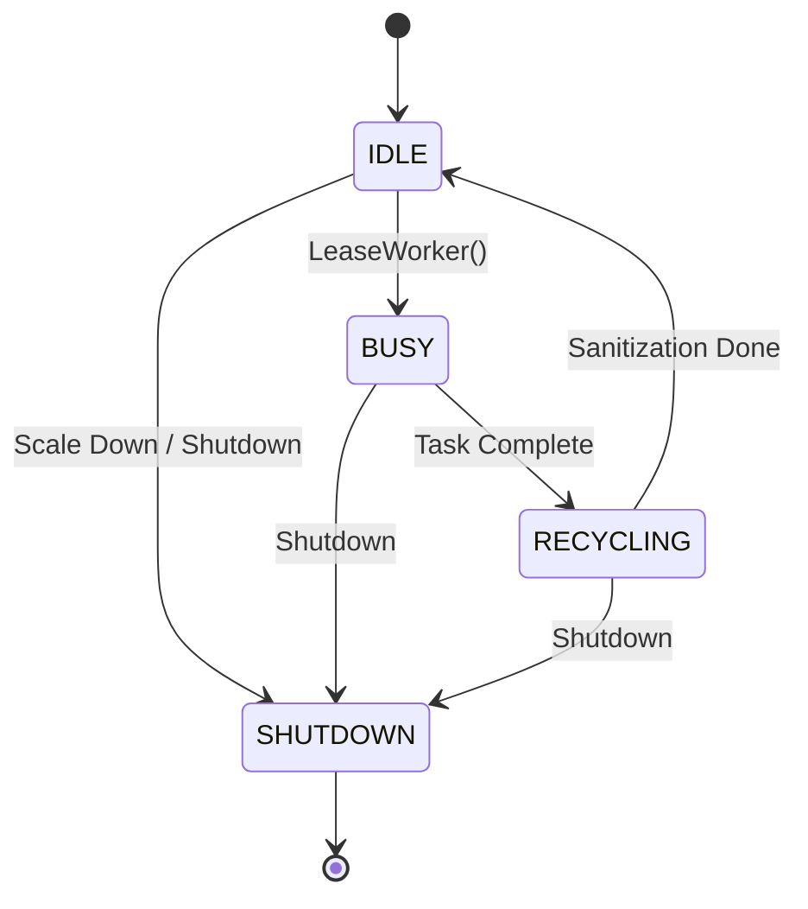

# DCodeX

A high-performance, gRPC-powered code execution engine featuring production-grade sandboxing, real-time bidirectional streaming, and an intelligent dynamic worker coordinator.

[](https://en.cppreference.com/w/cpp/17)
[](https://bazel.build/)
[](LICENSE)

## 🚀 Quick Start

```bash
# Build the production server
bazel build //src/api:server

# Run the server (default: localhost:50051)
bazel run //src/api:server

# Install Python client dependencies
pip install -r python_client/requirements.txt

# Run the client
python python_client/main.py --file examples/cpp/03_fibonacci.cpp
```

## 🏗️ Core Architecture: Dynamic Worker Coordinator

DCodeX features a sophisticated **Dynamic Worker Coordinator** that replaces static pools with a reactive, language-aware concurrency model.

### Key Capabilities

- **Language Affinity**: Pre-boots sandboxes with specialized runtimes (C++, Python) based on request patterns, reducing cold-start latency by up to 80%.
- **Dynamic Scaling**: A background `PoolBalancer` thread monitors request latency and queue depth, automatically scaling the worker pool between `min_workers` and `max_workers`.
- **Asynchronous Recycling**: After execution, workers enter a background `RECYCLING` state where temp files are wiped and namespaces are sanitized without blocking the main execution path.
- **Fair Queueing**: Implements a language-weighted fair-queueing mechanism to prevent starvation during high-load bursts of a single language type.

### Worker State Machine



## 🛠️ Server Configuration

| Flag | Default | Description |
|------|---------|-------------|
| `--port` | 50051 | gRPC server port |
| `--min_workers` | 2 | Minimum pre-booted workers |
| `--max_workers` | 20 | Maximum concurrent sandboxes |
| `--scale_up_latency_ms` | 100 | Latency threshold to trigger scaling |
| `--sandbox_cpu_limit` | 1s | CPU time limit per execution |
| `--sandbox_memory_limit` | 4GB | Memory limit per execution |

```bash
# Example: High-concurrency cluster configuration
bazel run //src/api:server -- --max_workers 64 --min_workers 8 --scale_up_latency_ms 50
```

## 📦 Project Structure

```text
DCodeX/
├── src/api/                  # gRPC Interface Layer
│   ├── execute_reactor.cpp   # Bidirectional stream handling
│   └── code_executor_service # Service lifecycle management
├── src/engine/               # Core Execution Engine
│   ├── dynamic_worker_coordinator # Intelligent resource orchestration
│   ├── sandbox.cpp           # SandboxedProcess implementation
│   ├── process_runner.cpp    # RAII-based process management
│   └── execution_pipeline.cpp # Command-pattern execution flow
├── src/common/               # Utilities & Caching
│   └── execution_cache.cpp   # LRU cache with TTL
├── proto/                    # Protocol Definitions
└── python_client/            # Reference Client Implementation
```

## 🧪 Testing & Reliability

DCodeX is built with a focus on concurrency safety and memory stability.

### Sanitizer Suite

We use industry-standard sanitizers to ensure a race-free and leak-free codebase:

```bash
# Run tests with ThreadSanitizer (TSan) to detect data races
bazel test --config=tsan //src/engine:dynamic_worker_coordinator_test

# Run tests with AddressSanitizer (ASan) for memory safety
bazel test --config=asan //src/engine:dynamic_worker_coordinator_test
```

### Best Practices

- **Abseil Integration**: Uses `absl::Mutex` and `absl::CondVar` for robust synchronization.
- **RAII Everything**: Resource acquisition is initialization for processes, files, and threads.
- **Lock Ordering**: Strict lock hierarchy to prevent deadlocks in the balancer and worker loops.

## 📜 License

Distributed under the Apache License 2.0. See `LICENSE` for more information.
