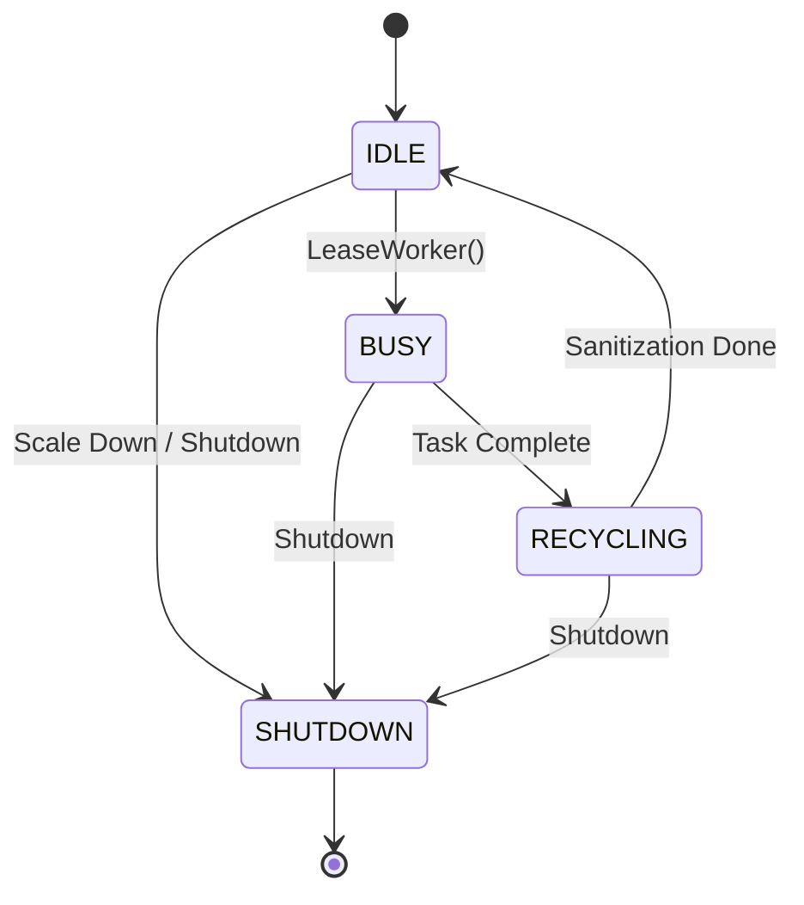

# DCodeX

A high-performance, gRPC-powered code execution engine featuring production-grade sandboxing, real-time bidirectional streaming, and an intelligent dynamic worker coordinator.

[](https://en.cppreference.com/w/cpp/17)
[](https://bazel.build/)
[](LICENSE)

## 🚀 Quick Start

```bash
# Build the production server
bazel build //src/api:server

# Run the server (default: localhost:50051)
bazel run //src/api:server

# Install Python client dependencies
pip install -r python_client/requirements.txt

# Run the client
python python_client/main.py --file examples/cpp/03_fibonacci.cpp
```

## 🚀 Performance & Platform Optimization

DCodeX is optimized for maximum build and test speed out of the box.

### Default: High-Performance Linux
By default, DCodeX assumes a high-performance Linux environment and optimizes for speed:
- **Parallelism**: Defaults to `--jobs 20` and `--linkopt=-Wl,--threads=16`.
- **Resources**: Pre-allocates 16 CPUs and 56GB RAM for the build/test execution.
- **Fast Linking**: Uses `lld` (the LLVM linker) on Linux for near-instant link times.

### macOS (M1/M2/M3)
On macOS, DCodeX automatically detects the Silicon architecture and tunes itself:
- **Optimization**: Uses `--cpu=darwin_arm64` and `--macos_cpus=arm64`.
- **Resource Guardrails**: Throttles to 8 CPUs and 16GB RAM to maintain UI responsiveness while building.

```bash
# Explicitly use the high-performance Linux config (if not auto-detected)
bazel build --config=linux //src/api:server

# Explicitly use the macOS Silicon config
bazel build --config=macos //src/api:server
```

## 🏗️ Core Architecture: Dynamic Worker Coordinator

DCodeX features a sophisticated **Dynamic Worker Coordinator** that replaces static pools with a reactive, language-aware concurrency model.

### Key Capabilities

- **Language Affinity**: Pre-boots sandboxes with specialized runtimes (C++, Python) based on request patterns, reducing cold-start latency by up to 80%.
- **Dynamic Scaling**: A background `PoolBalancer` thread monitors request latency and queue depth, automatically scaling the worker pool between `min_workers` and `max_workers`.
- **Asynchronous Recycling**: After execution, workers enter a background `RECYCLING` state where temp files are wiped and namespaces are sanitized without blocking the main execution path.
- **Fair Queueing**: Implements a language-weighted fair-queueing mechanism to prevent starvation during high-load bursts of a single language type.

### Worker State Machine



## 🛠️ Server Configuration

| Flag | Default | Description |
|------|---------|-------------|
| `--port` | 50051 | gRPC server port |
| `--min_workers` | 2 | Minimum pre-booted workers |
| `--max_workers` | 20 | Maximum concurrent sandboxes |
| `--scale_up_latency_ms` | 100 | Latency threshold to trigger scaling |
| `--sandbox_cpu_limit` | 1s | CPU time limit per execution |
| `--sandbox_memory_limit` | 4GB | Memory limit per execution |

```bash
# Example: High-concurrency cluster configuration
bazel run //src/api:server -- --max_workers 64 --min_workers 8 --scale_up_latency_ms 50
```

## 📦 Project Structure

```text
DCodeX/
├── src/api/                  # gRPC Interface Layer
│   ├── execute_reactor.cpp   # Bidirectional stream handling
│   └── code_executor_service # Service lifecycle management
├── src/engine/               # Core Execution Engine
│   ├── dynamic_worker_coordinator # Intelligent resource orchestration
│   ├── sandbox.cpp           # SandboxedProcess implementation
│   ├── process_runner.cpp    # RAII-based process management
│   └── execution_pipeline.cpp # Command-pattern execution flow
├── src/common/               # Utilities & Caching
│   └── execution_cache.cpp   # LRU cache with TTL
├── proto/                    # Protocol Definitions
└── python_client/            # Reference Client Implementation
```

## 🛡️ Correctness & Reliability First

DCodeX prioritizes architectural correctness over raw speed. We use a multi-layered verification strategy to ensure the system is production-ready.

### 1. Static Analysis (Audit Mode)
We use Clang's **Thread Safety Analysis** and strict compiler warnings to catch bugs at compile-time. Our `audit` configuration enforces:
- `ABSL_GUARDED_BY` annotations on all shared state.
- Zero-tolerance for shadowed variables or unsafe type conversions.
- Header parsing verification to ensure clean dependency graphs.

```bash
# Run a full correctness audit
bazel build --config=audit //...
```

### 2. Dynamic Verification (Sanitizers)
We use platform-aware sanitizers to catch runtime edge cases that static analysis might miss:

```bash
# Detect data races & deadlocks (Runs tests 20x)
bazel test --config=tsan //...

# Detect memory corruption & leaks
bazel test --config=asan //...
```

### 3. Production Hardening Checklist
Before any major release, we verify:
- [x] **Race-Free State Transitions**: Verified via TSan stress tests.
- [x] **RAII Resource Lifecycle**: No PID leaks or zombie processes after cancellation.
- [x] **Sandbox Hermeticity**: Resource limits (CPU/MEM) are strictly enforced.
- [x] **Lock Hierarchy**: Documented in `dynamic_worker_coordinator.cpp` to prevent AB-BA deadlocks.

### Best Practices
- **Abseil Synchronization**: Prefer `absl::Mutex` over `std::mutex` for better deadlock detection and thread-safety annotations.
- **Static Linking**: All tests use `linkstatic = True` to ensure stable, hermetic execution in sandboxed environments.
- **Hermetic Build Env**: Uses `--incompatible_strict_action_env` to prevent host environment leakage.

## 📜 License

Distributed under the Apache License 2.0. See `LICENSE` for more information.
